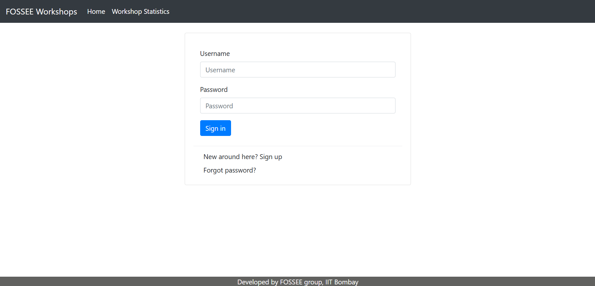
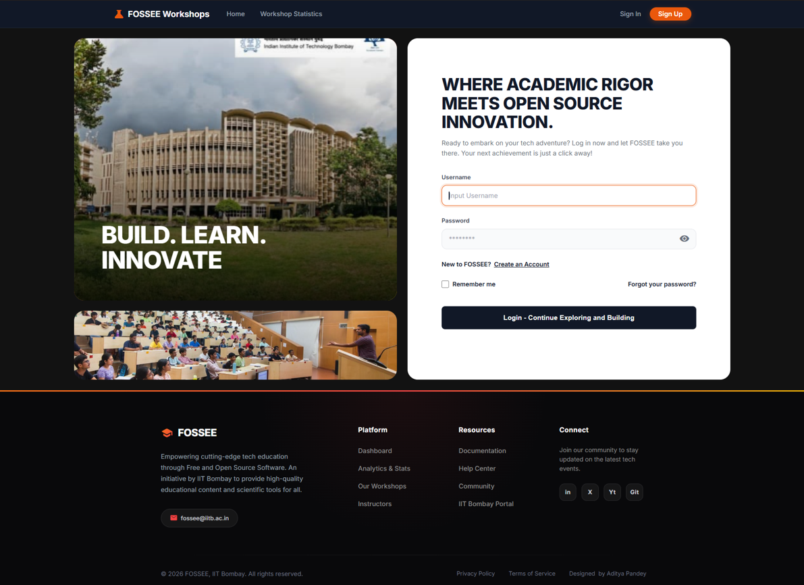
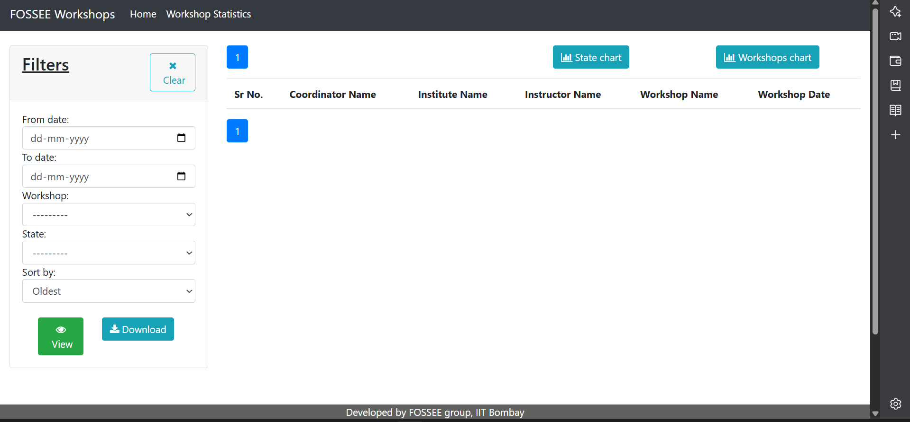
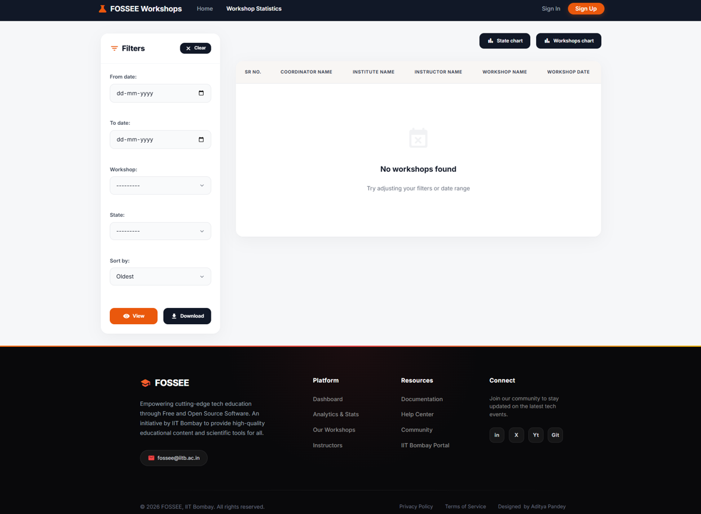

# **FOSSEE Workshop Booking Platform**

> This website is for coordinators to book a workshop(s). They can book a workshop based on instructors' posts or can propose a workshop date based on their convenience.

## 🎨 UI/UX Enhancement & React Migration

This project recently underwent a major UI/UX enhancement to modernize the existing Django-based Workshop Booking platform. The goal was to enhance usability, responsiveness, and visual design while maintaining the core functionality of the application. The redesign prioritizes clarity, accessibility, and a premium modern user experience.

### Technical Architecture & Design Principles

1. **Separation of Concerns:** We cleanly decoupled the backend data layer (Django) from the presentation layer (React/Vite). The tightly coupled Django view logic was systematically migrated into stateless REST APIs using Django Rest Framework (DRF) and custom Serializers.
2. **Custom Design System (Vanilla CSS):** Instead of relying on heavy CSS frameworks like Tailwind, we established a strict, consistent design system using **Vanilla CSS and CSS Variables** (Design Tokens). This allowed us to build highly customized effects, dynamic micro-animations, and a cohesive color grading palette that ensures a premium look across the entire application while remaining easily maintainable.
3. **Mobile-First Approach:** The UI scales upward using **CSS Flexbox and CSS Grid** to smoothly transition components from mobile-friendly defaults into multi-column layouts on tablets and large desktop monitors.
4. **Client-Side Rendering (CSR):** By utilizing React and Vite, the trade-off of a slightly larger initial JavaScript bundle is vastly offset by superior performance and highly dynamic design interactions during subsequent navigations, resulting in a significantly better overall User Experience (UX).

---

## 🛠 Core Features

### Statistics
1. **Instructors Only**
    * Monthly Workshop Count
    * Instructor/Coordinator Profile stats
    * Upcoming Workshops
    * View/Post comments on Coordinator's Profile
2. **Open to All**
    * Workshops taken over Map of India
    * Pie chart based on Total Workshops taken to Type of Workshops.

### Workshop Related Features
> Instructors can Accept, Reject or Delete workshops based on their preference, also they can postpone a workshop based on coordinators request.

---

## 📸 Before and After Features

**Home Before:**  


**Home After:**  


**Workshop Statistics Before:**  


**Workshop Statistics After:**  


---

## 🚀 Setup Instructions

This project is divided into two distinct applications: a Django Backend API and a React Frontend. You will need two terminals running simultaneously to start the project.

### 1. Backend Setup (Django)
Navigate to the root directory of the project.

```bash
# 1. Create and activate a virtual environment 
python -m venv venv
# On Windows:
venv\Scripts\activate
# On Mac/Linux:
# source venv/bin/activate

# 2. Install dependencies
pip install -r requirements.txt

# 3. Apply database migrations
python manage.py migrate

# 4. Start the backend development server
python manage.py runserver
```

### 2. Frontend Setup (React / Vite)
Open a new terminal and navigate to the `frontend` folder.

```bash
# 1. Move to the frontend directory
cd frontend

# 2. Install node module dependencies
npm install

# 3. Start the Vite development server
npm run dev
```

Your React frontend will typically run on `http://localhost:5173` and communicate with the Django backend running on `http://localhost:8000`.

---
__NOTE__: Check `docs/Getting_Started.md` for more historical info on the backend architecture.
