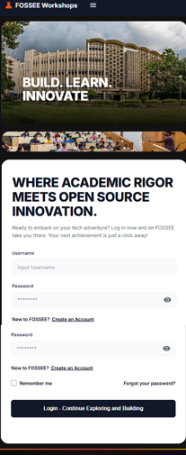
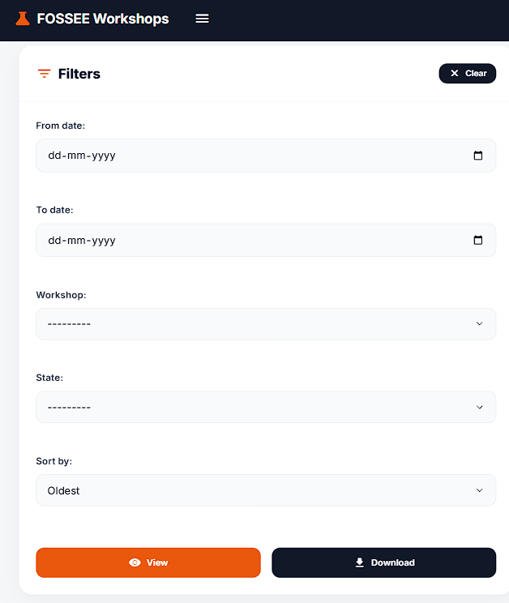

# 🎨 Python Screening Task: UI/UX Enhancement

## 📌 Overview
This project focuses on elevating the UI/UX of the existing Workshop Booking platform provided by FOSSEE. The goal was to evolve a conventional interface into a more refined, high-performance experience by improving usability, responsiveness, and visual consistency—while preserving the original backend functionality.

The redesign emphasizes clarity, accessibility, and a modern, application-like feel, ensuring smooth navigation across both desktop and mobile devices.

---

## 🚀 Features & Improvements

### 🏠 Home & Login Experience
* **Enhanced Hero Section**: Designed a clean landing interface with strong call-to-action elements, helping users quickly understand the platform and navigate efficiently.
* **Balanced Split Layout**: Introduced a structured split-screen login design that combines functional input areas with visual elements for a more engaging and professional look.
* **Modern Glass UI**: Applied subtle glassmorphism effects using `backdrop-filter` and transparency to create a layered, premium interface without compromising readability.
* **Continuous Layout Flow**: Improved visual continuity by extending a consistent gradient background across the entire viewport, eliminating layout breaks and ensuring a seamless user experience.

### 📊 Workshop Statistics Page
* **Dashboard-Oriented Design**: Transformed the layout into a dashboard-style interface with a dedicated filter section, making data exploration more intuitive.
* **Improved Data Focus**: Enhanced spacing, alignment, and structure within tables to highlight key information and reduce visual clutter.
* **Consistent Theming**: Maintained a unified dark theme across all UI elements, including charts and controls, to deliver a cohesive and immersive experience.

### 📝 Registration & Success Flow
* **Structured Form Layouts**: Replaced traditional layouts with card-based designs to improve clarity and guide users more effectively through input steps.
* **Clear User Feedback**: Redesigned feedback screens such as "Forgot Password" and "Reset Success" into minimal, centered components that communicate outcomes clearly and efficiently.

---
## 🎨 Design Principles & Technical Logic

### Strategic Improvements
The redesign was driven by the core principles of **clarity, simplicity, and strong visual hierarchy**. By transitioning the platform to a **Single Page Application (SPA)** architecture using React, the interface now delivers smooth, instant transitions without disruptive page reloads. A consistent design system was also established, ensuring uniformity in typography, spacing, and color usage across all screens, which enhances overall coherence and brand trust.

### Responsive Implementation
A **mobile-first approach** was adopted to achieve responsiveness, leveraging flexible layouts with Flexbox and Grid. Instead of fixed sizing, components were designed to adapt fluidly across screen sizes. For instance, split-screen sections intelligently transform into single-column layouts on smaller devices, improving readability and making interactive elements like forms and buttons more accessible on touch devices.

### Design vs. Performance Trade-offs
To maintain a balance between visual richness and performance, **client-side rendering (CSR)** was implemented. Although it introduces a slight delay during the initial load, it significantly improves responsiveness during user interaction. Additionally, lightweight CSS effects such as glassmorphism and gradients were preferred over heavy images, ensuring a modern aesthetic while keeping the application fast and efficient.

### Overcoming Layout Challenges
A key challenge involved maintaining **visual continuity** across separate UI modules. The original layout had noticeable gaps and inconsistent spacing, which disrupted the overall experience. This was resolved by refining the global `index.css`, allowing the background gradient to fully cover the viewport. This approach eliminated layout breaks and produced a cohesive, polished interface.
## Before and After Screenshots

**Home Before:**  


**Home After:**  


**Workshop Statistics Before:**  


**Workshop Statistics After:**  


**Responsiveness 1:**


**Responsiveness 2:**


---

## Setup Instructions

This project is divided into two distinct applications: a Django Backend API and a React Frontend. You will need two terminals running simultaneously to start the project.

### 1. Backend Setup (Django)
Navigate to the root directory of the project.

```bash
# 1. Create and activate a virtual environment 
python -m venv venv
# On Windows:
venv\Scripts\activate
# On Mac/Linux:
# source venv/bin/activate

# 2. Install dependencies
pip install -r requirements.txt

# 3. Apply database migrations
python manage.py migrate

# 4. Start the backend development server
python manage.py runserver
```

### 2. Frontend Setup (React / Vite)
Open a new terminal and navigate to the `frontend` folder.

```bash
# 1. Move to the frontend directory
cd frontend

# 2. Install node module dependencies
npm install

# 3. Start the Vite development server
npm run dev
```

Your React frontend will typically run on `http://localhost:5173` and communicate with the Django backend running on `http://localhost:8000`.

---
__NOTE__: Check `docs/Getting_Started.md` for more historical info on the backend architecture.

## Student Details

Name: Aditya Pandey

Institution Name: VIT Bhopal


Email Id: pandeyap2605@gmail.com


College Email Id: aditya.23bce10203@vitbhopal.ac.in


Repository link: *https://github.com/adityagit2605/workshop_booking.git*

---